<!-- skald-render 6dbc23180e6a23cc -->
# skald backlog

**37 open** · Backlog 1 · Ready 1 · In progress 0 · Review 35 · Done 15

Rendered by [Skald](https://github.com/Vitund-AI/skald) from the story files in this directory. Regenerate with `skald render`.

## Dependencies

```mermaid
flowchart LR
    n_46b5d3["46b5d3<br/>skald render: committed board snapshot,…"]
    n_9a1da4["9a1da4<br/>Add an archive command for done stories"]
    n_bae374["bae374<br/>Offer a pipx-installable package with a…"]
    n_cbb58e["cbb58e<br/>Facet tags and epic progress"]
    n_cbb58e --> n_46b5d3
    n_9a1da4 --> n_bae374
    classDef active fill:#fef3c7,stroke:#f59e0b,color:#1e293b
    classDef done fill:#d1fae5,stroke:#34d399,color:#475569
    class n_46b5d3,n_cbb58e active
    class n_9a1da4,n_bae374 done
```

## Backlog (1)

| ID | Title | Tags | Assignee | Blocked by | Progress |
| --- | --- | --- | --- | --- | --- |
| [be447c](stories/be447c-rename-a-project-with-reference-rewriting.md) | Rename a project with reference rewriting | `cli` |  |  |  |

## Ready (1)

| ID | Title | Tags | Assignee | Blocked by | Progress |
| --- | --- | --- | --- | --- | --- |
| [b91662](stories/b91662-publish-0-2-0-to-pypi.md) | Publish 0.2.0 to PyPI | `packaging` |  |  |  |

## In progress (0)

_none_

## Review (35)

| ID | Title | Tags | Assignee | Blocked by | Progress |
| --- | --- | --- | --- | --- | --- |
| [aab06f](stories/aab06f-claude-code-hooks.md) | Claude Code hooks | `agents` |  |  |  |
| [9e4f8e](stories/9e4f8e-story-templates.md) | Story templates | `cli` |  |  |  |
| [c78e01](stories/c78e01-bulk-operations-on-the-board.md) | Bulk operations on the board | `ui` | claude |  |  |
| [c5e56b](stories/c5e56b-ci-and-pypi-publishing-workflows.md) | CI and PyPI publishing workflows | `packaging` |  |  |  |
| [883a6a](stories/883a6a-server-sent-events-for-live-board-updates.md) | Server-sent events for live board updates | `ui` |  |  |  |
| [862dae](stories/862dae-mcp-server-mode.md) | MCP server mode | `agents` |  |  |  |
| [d8a25c](stories/d8a25c-read-only-views-of-other-branches.md) | Read-only views of other branches | `core` `ui` | claude |  | 0/6 |
| [cbb58e](stories/cbb58e-facet-tags-and-epic-progress.md) | Facet tags and epic progress | `core` `ui` | claude |  | 0/4 |
| [46b5d3](stories/46b5d3-skald-render-committed-board-snapshot-pre-commit-h.md) | skald render: committed board snapshot, pre-commit hook, GitHub Action | `cli` `docs` | claude | 🔒 `cbb58e` | 0/7 |
| [dea072](stories/dea072-compact-output-and-skald-context-for-agent-orienta.md) | Compact output and skald context for agent orientation | `agents` | claude |  |  |
| [04625a](stories/04625a-handoff-notes-and-skald-resume.md) | Handoff notes and skald resume | `agents` | claude |  |  |
| [aa1ade](stories/aa1ade-acceptance-criteria-as-an-advisory-gate.md) | Acceptance criteria as an advisory gate | `core` | claude |  |  |
| [654c29](stories/654c29-claim-awareness-across-worktrees-and-stale-claims.md) | Claim awareness across worktrees and stale claims | `agents` `core` | claude |  |  |
| [5c4f0c](stories/5c4f0c-link-commits-to-stories-with-a-skald-story-trailer.md) | Link commits to stories with a Skald-Story trailer | `git` | claude |  |  |
| [610eef](stories/610eef-skald-diff-between-refs-and-a-pr-comment-from-the.md) | skald diff between refs and a PR comment from the workflow | `docs` `git` | claude |  |  |
| [f4fa85](stories/f4fa85-skald-activity-backlog-transitions-from-git-histor.md) | skald activity: backlog transitions from git history | `git` | claude |  |  |
| [419b5c](stories/419b5c-claude-code-skill-and-init-writing-the-instruction.md) | Claude Code skill and init writing the instructions pointer | `agents` | claude |  |  |
| [12c4d1](stories/12c4d1-dependency-graph-mermaid-in-render-skald-graph-svg.md) | Dependency graph: Mermaid in render, skald graph, SVG on the board | `docs` `ui` | claude |  |  |
| [68a39b](stories/68a39b-confirm-windows-and-macos-behaviour-from-ci.md) | Confirm Windows and macOS behaviour from CI | `packaging` |  |  |  |
| [c5f90f](stories/c5f90f-board-polish-dark-mode-layout-fixes-keyboard-acces.md) | Board polish: dark mode, layout fixes, keyboard access, empty states | `ui` | claude |  | 8/8 |
| [bd9aca](stories/bd9aca-help-panel-with-keyboard-shortcuts-and-the-cli-ref.md) | Help panel with keyboard shortcuts and the CLI reference | `docs` `ui` | claude |  | 4/4 |
| [f7674b](stories/f7674b-verify-the-board-with-tailwind-loaded-in-a-real-br.md) | Verify the board with Tailwind loaded in a real browser | `ui` |  |  |  |
| [d3c39e](stories/d3c39e-rename-mv-to-move.md) | Rename mv to move | `cli` | claude |  |  |
| [1b15cc](stories/1b15cc-install-from-github-until-the-first-pypi-release.md) | Install from GitHub until the first PyPI release | `docs` `packaging` | claude |  |  |
| [61b53c](stories/61b53c-shell-completion-for-bash-zsh-and-fish.md) | Shell completion for bash, zsh, and fish | `cli` | claude |  | 5/5 |
| [664976](stories/664976-readme-screenshots-board-story-terminal-session-co.md) | README screenshots: board, story, terminal session, completion, graph, multi-select | `docs` | claude |  |  |
| [95e3a5](stories/95e3a5-skald-release-changelog-section-from-the-done-colu.md) | skald release: changelog section from the done column, then archive with a version stamp | `cli` `git` | claude |  | 6/6 |
| [71f880](stories/71f880-user-docs-guides-under-docs-and-a-generated-cli-re.md) | User docs: guides under docs/ and a generated CLI reference | `docs` | claude |  | 4/4 |
| [43a999](stories/43a999-board-server-authentication-machine-local-token-se.md) | Board server authentication: machine-local token, session cookie, bearer header | `core` `ui` | claude |  | 5/5 |
| [b2f19e](stories/b2f19e-render-workflow-commits-as-github-actions-bot-not.md) | Render workflow commits as github-actions[bot], not a real user's noreply address | `git` `packaging` | claude |  | 2/2 |
| [8c4d2c](stories/8c4d2c-checkouts-see-every-worktree-s-working-tree-on-the.md) | Checkouts: see every worktree's working tree on the board, claims visible before commit | `agents` `core` `ui` | claude |  | 6/6 |
| [43641e](stories/43641e-branch-dropdown-say-worktree-or-clone-on-working-t.md) | Branch dropdown: say worktree or clone on working-tree entries, mark branches that have one as committed only | `ui` | claude |  | 3/3 |
| [b1ef9b](stories/b1ef9b-docs-sweep-for-checkouts-readme-bullets-and-index.md) | Docs sweep for checkouts: README bullets and index rows, agent contract, Help panel legend, git-and-ci | `docs` | claude |  | 4/4 |
| [2a929c](stories/2a929c-changelog-text-on-every-story-before-the-0-2-0-rel.md) | Changelog text on every story before the 0.2.0 release | `docs` | claude |  | 2/2 |
| [8ffede](stories/8ffede-promote-a-surviving-checkout-when-the-primary-s-di.md) | Promote a surviving checkout when the primary's directory has gone | `core` | claude |  | 4/4 |

<strong>Done (15)</strong>

| ID | Title | Tags | Assignee | Blocked by | Progress |
| --- | --- | --- | --- | --- | --- |
| [9bf832](stories/9bf832-dependency-graph-view.md) | Dependency graph view | `ui` |  |  |  |
| [b5d7d7](stories/b5d7d7-custom-columns-with-roles-and-wip-limits.md) | Custom columns with roles and WIP limits | `core` `ui` |  |  |  |
| [058512](stories/058512-cross-project-dependencies-as-project-id.md) | Cross-project dependencies as project:id | `core` |  |  |  |
| [63898e](stories/63898e-per-project-config-json-with-name-and-format-versi.md) | Per-project config.json with name and format version | `core` |  |  |  |
| [e0cc9f](stories/e0cc9f-render-the-story-body-as-markdown-in-the-modal.md) | Render the story body as Markdown in the modal | `ui` |  |  |  |
| [92086e](stories/92086e-publish-a-pre-commit-hook-recipe-that-runs-skald-c.md) | Publish a pre-commit hook recipe that runs skald check | `docs` |  |  |  |
| [4ed498](stories/4ed498-author-identity-for-notes-and-claims.md) | Author identity for notes and claims | `core` |  |  |  |
| [0b108f](stories/0b108f-board-checklist-progress-stale-marker-branch-histo.md) | Board: checklist progress, stale marker, branch, history tab, keyboard shortcuts | `ui` |  |  |  |
| [8d081d](stories/8d081d-git-integration-status-commit-log-changelog-board.md) | Git integration: status, commit, log, changelog, board commit button | `git` `ui` |  |  |  |
| [830b31](stories/830b31-board-project-switcher-and-all-projects-ready-view.md) | Board: project switcher and all-projects ready view | `ui` |  |  |  |
| [9a1da4](stories/9a1da4-add-an-archive-command-for-done-stories.md) | Add an archive command for done stories | `cli` |  |  |  |
| [670177](stories/670177-daemon-background-mode-for-the-web-server.md) | Daemon (background) mode for the web server | `ui` |  |  |  |
| [bae374](stories/bae374-offer-a-pipx-installable-package-with-a-global-ska.md) | Offer a pipx-installable package with a global skald command | `packaging` |  | `9a1da4` |  |
| [3da635](stories/3da635-add-an-optional-assignee-field-for-multi-agent-set.md) | Add an optional assignee field for multi-agent setups | `cli` `ui` |  |  |  |
| [189d1b](stories/189d1b-machine-local-project-index-with-auto-registration.md) | Machine-local project index with auto-registration | `core` |  |  |  |

