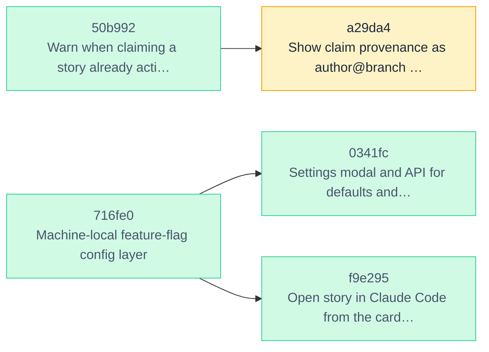

<!-- skald-render ceb819c8165c8c30 -->
# skald backlog

**5 open** · Idea 2 · Plan 0 · Ready 0 · In progress 0 · Review 3 · Done 6

Rendered by [Skald](https://github.com/Vitund-AI/skald) from the story files in this directory. Regenerate with `skald render`.

## Epics

| Epic | Progress | Done | Open |
| --- | --- | ---: | ---: |
| `epic:feature-flags` | ▰▰▰▰▰▰▰▰▱▱ 75% | 3 | 1 |

## Dependencies

## Idea (2)

| ID | Title | Tags | Assignee | Blocked by | Progress |
| --- | --- | --- | --- | --- | --- |
| [b56d9e](stories/b56d9e-example-one-way-import-from-github-issues.md) | Example: one-way import from GitHub issues | `examples` `roadmap` |  |  |  |
| [0d8904](stories/0d8904-advertise-swimlanes-show-the-control-disabled-with.md) | Advertise swimlanes: show the control disabled with a hint when no facets exist | `area:board` |  |  | 0/6 |

## Plan (0)

_none_

## Ready (0)

_none_

## In progress (0)

_none_

## Review (3)

| ID | Title | Tags | Assignee | Blocked by | Progress |
| --- | --- | --- | --- | --- | --- |
| [3eea32](stories/3eea32-opt-in-update-check-show-an-update-available-icon.md) | Opt-in update check: show an update-available icon on the board | `area:board` `epic:feature-flags` | claude |  | 10/10 |
| [a29da4](stories/a29da4-show-claim-provenance-as-author-branch-on-the-boar.md) | Show claim provenance as author@branch on the board and in ls | `area:board` `area:cli` | claude | `50b992` | 6/6 |
| [938c9c](stories/938c9c-make-the-screenshot-harness-extensible-and-showcas.md) | Make the screenshot harness extensible and showcase the new features | `area:docs` | claude |  | 7/7 |

<strong>Done (6)</strong>

| ID | Title | Tags | Assignee | Blocked by | Progress |
| --- | --- | --- | --- | --- | --- |
| [ce8ab1](stories/ce8ab1-completion-and-api-tests-pick-a-unique-id-prefix-n.md) | Completion and API tests pick a unique id prefix, not a fixed slice | `tests` | claude |  | 1/1 |
| [947089](stories/947089-release-sh-tags-the-merge-commit-not-a-skip-ci-ren.md) | release.sh tags the merge commit, not a [skip ci] render HEAD | `area:release` | claude |  | 4/4 |
| [716fe0](stories/716fe0-machine-local-feature-flag-config-layer.md) | Machine-local feature-flag config layer | `area:config` `epic:feature-flags` | claude |  | 7/7 |
| [0341fc](stories/0341fc-settings-modal-and-api-for-defaults-and-per-projec.md) | Settings modal and API for defaults and per-project options | `area:board` `epic:feature-flags` | claude | `716fe0` | 8/8 |
| [f9e295](stories/f9e295-open-story-in-claude-code-from-the-card-detail-vie.md) | Open story in Claude Code from the card detail view | `area:board` `epic:feature-flags` | claude | `716fe0` | 8/8 |
| [50b992](stories/50b992-warn-when-claiming-a-story-already-active-in-anoth.md) | Warn when claiming a story already active in another local worktree, same author included | `area:cli` | claude |  | 7/7 |

## Releases

<strong>0.7.0 (11)</strong>

| ID | Title | Tags | Assignee | Blocked by | Progress |
| --- | --- | --- | --- | --- | --- |
| [d5cd0f](archive/d5cd0f-a-conventions-page-the-facets-and-what-each-unlock.md) | A conventions page: the facets and what each unlocks | `docs` `roadmap` | claude |  |  |
| [18c326](archive/18c326-browse-what-shipped-by-release-on-the-board.md) | Browse what shipped, by release, on the board | `roadmap` | claude |  |  |
| [011410](archive/011410-collapse-terminal-columns-on-the-board-per-viewer.md) | Collapse terminal columns on the board, per viewer | `roadmap` | claude |  |  |
| [c5a7b5](archive/c5a7b5-digest-groups-its-output-by-action-not-by-story.md) | digest groups its output by action, not by story | `cli` | claude |  | 3/3 |
| [0f9649](archive/0f9649-document-how-to-model-won-t-do-the-closed-role-and.md) | Document how to model won't-do: the closed role and the archive | `roadmap` | claude |  |  |
| [e1ef91](archive/e1ef91-open-questions-at-the-top-of-the-rendered-board.md) | Open questions at the top of the rendered board | `roadmap` | claude |  |  |
| [a729bb](archive/a729bb-rendered-board-doc-lists-what-shipped-grouped-by-r.md) | Rendered board doc lists what shipped, grouped by release | `roadmap` | claude |  |  |
| [91e595](archive/91e595-skald-digest-the-human-s-context-what-changed-sinc.md) | skald digest: the human's context, what changed since you last looked | `roadmap` | claude |  |  |
| [9c5d75](archive/9c5d75-skald-doctor-one-command-for-why-it-is-not-working.md) | skald doctor: one command for why it is not working | `roadmap` | claude |  | 0/7 |
| [1a5064](archive/1a5064-story-references-in-notes-resolve-on-the-board-and.md) | Story references in notes resolve on the board and in show | `roadmap` | claude |  |  |
| [527a9c](archive/527a9c-target-release-tag-and-a-release-warning.md) | Target-release tag and a release warning | `roadmap` | claude |  |  |

<strong>0.6.0 (10)</strong>

| ID | Title | Tags | Assignee | Blocked by | Progress |
| --- | --- | --- | --- | --- | --- |
| [682ae0](archive/682ae0-ci-skips-lint-and-tests-for-documentation-only-cha.md) | CI skips lint and tests for documentation-only changes, without leaving required checks pending | `ci` | claude |  | 3/3 |
| [a92b73](archive/a92b73-cli-reference-is-plain-text-under-python-3-14-s-co.md) | CLI reference is plain text under Python 3.14's coloured argparse | `ci` `cli` | claude |  | 0/3 |
| [c42f18](archive/c42f18-python-3-10-to-3-14-drop-3-9-test-on-3-14.md) | Python 3.10 to 3.14: drop 3.9, test on 3.14 | `ci` | claude |  | 3/3 |
| [b63598](archive/b63598-readme-screenshots-the-board-on-the-lifecycle-colu.md) | README screenshots: the board on the lifecycle columns, from a reproducible demo project | `docs` | claude |  |  |
| [fab7b8](archive/fab7b8-release-flow-documented-as-run-bump-and-release-to.md) | Release flow documented as run: bump and release together on dev, PR to main, tag | `docs` | claude |  |  |
| [b6866d](archive/b6866d-release-v0-5-1-version-file-never-bumped-v-prefixe.md) | Release v0.5.1: version file never bumped, v-prefixed heading blinded the guard | `release` | claude |  | 4/4 |
| [83c6b3](archive/83c6b3-scripts-release-sh-the-release-as-one-checked-repe.md) | scripts/release.sh: the release as one checked, repeatable sequence with a dry run | `release` | claude |  | 3/3 |
| [415a12](archive/415a12-security-policy-and-the-flow-for-patching-an-earli.md) | Security policy and the flow for patching an earlier release | `docs` `security` | claude |  | 3/3 |
| [abc3c4](archive/abc3c4-story-dialog-view-mode-by-default-a-copyable-id-a.md) | Story dialog: view mode by default, a copyable id, a deep link | `board` | claude |  | 4/4 |
| [95b1fd](archive/95b1fd-vitund-design-system-tokens-dark-by-default-fonts.md) | Vitund design system: tokens, dark by default, fonts, a theme override file | `board` | claude |  | 5/5 |

<strong>0.5.1 (4)</strong>

| ID | Title | Tags | Assignee | Blocked by | Progress |
| --- | --- | --- | --- | --- | --- |
| [5dd1b9](archive/5dd1b9-code-of-conduct-and-contribution-guide.md) | Code of conduct and contribution guide | `docs` | claude |  | 3/3 |
| [b635fa](archive/b635fa-codeql-findings-workflow-token-permissions-templat.md) | CodeQL findings: workflow token permissions, template name traversal, question reference regex | `security` | claude |  | 4/4 |
| [dd8c14](archive/dd8c14-lint-in-ci-ruff-with-the-bugbear-and-bandit-rule-s.md) | Lint in CI: ruff with the bugbear and bandit rule sets, Dependabot for actions | `ci` | claude |  | 5/5 |
| [355b94](archive/355b94-workflows-current-action-majors-which-run-on-node.md) | Workflows: current action majors, which run on Node 24 | `ci` | claude |  | 3/3 |

<strong>0.5.0 (3)</strong>

| ID | Title | Tags | Assignee | Blocked by | Progress |
| --- | --- | --- | --- | --- | --- |
| [092468](archive/092468-model-routing-example-intent-tags-model-as-author.md) | Model routing example: intent tags, model as author, an executive loop over subagents | `docs` `examples` | claude |  | 3/3 |
| [da3085](archive/da3085-next-tag-the-next-unblocked-ready-story-carrying-a.md) | next --tag: the next unblocked ready story carrying a tag | `cli` | claude |  | 3/3 |
| [07d6b4](archive/07d6b4-readme-hero-line-and-opening-paragraph-sell-the-id.md) | README: hero line and opening paragraph sell the idea-to-release arc | `docs` | claude |  |  |

<strong>0.4.1 (6)</strong>

| ID | Title | Tags | Assignee | Blocked by | Progress |
| --- | --- | --- | --- | --- | --- |
| [abb68f](archive/abb68f-board-answer-one-question-at-a-time.md) | Board: answer one question at a time | `board` | claude |  | 3/3 |
| [307343](archive/307343-changelog-0-4-0-drop-the-duplicated-bullets-and-th.md) | Changelog 0.4.0: drop the duplicated bullets and the stale 0.3.0 line |  | claude |  |  |
| [ce0dac](archive/ce0dac-flaky-test-audit-test-cites-the-seed-commit-by-sho.md) | Flaky test: audit test cites the seed commit by short sha, which may have no letters | `tests` | claude |  |  |
| [b82d9b](archive/b82d9b-import-review-0-4-0-links-across-roots-git-added-d.md) | Import review 0.4.0: links across roots, git-added dates, path tags, mapping validation | `import` | claude |  | 6/6 |
| [b91662](archive/b91662-publish-0-2-0-to-pypi.md) | Publish to PyPI | `packaging` | claude |  |  |
| [d083ba](archive/d083ba-questions-close-only-when-a-decision-names-them-st.md) | Questions close only when a decision names them; stable Q-numbers; --all and --withdraw | `questions` | claude |  | 7/7 |

<strong>0.4.0 (5)</strong>

| ID | Title | Tags | Assignee | Blocked by | Progress |
| --- | --- | --- | --- | --- | --- |
| [01c403](archive/01c403-context-caps-waiting-on-a-human-at-five-stories.md) | context caps Waiting on a human at five stories | `agents` | claude |  | 2/2 |
| [288335](archive/288335-review-notes-resume-map-one-heading-per-line-answe.md) | Review notes: resume map one heading per line, answer --question N | `agents` `cli` | claude |  | 2/2 |
| [e2c6c8](archive/e2c6c8-rm-force-clears-the-references-it-would-orphan.md) | rm --force clears the references it would orphan | `cli` `core` | claude |  | 2/2 |
| [382a77](archive/382a77-skald-import-bring-a-markdown-backlog-folder-in-ma.md) | skald import: bring a Markdown backlog folder in, mapping-driven, reproducibly | `cli` `docs` | claude |  | 3/3 |
| [380af0](archive/380af0-version-guard-the-changelog-s-newest-release-must.md) | Version guard: the changelog's newest release must match __version__ | `packaging` | claude |  | 2/2 |

<strong>0.3.0 (12)</strong>

| ID | Title | Tags | Assignee | Blocked by | Progress |
| --- | --- | --- | --- | --- | --- |
| [fcecad](archive/fcecad-backdating-flags-note-at-and-new-created-at-for-mi.md) | Backdating flags: note --at and new --created-at for migration scripts | `cli` | claude |  | 2/2 |
| [f3bac3](archive/f3bac3-claude-code-sessionstart-hook-runs-skald-context-n.md) | Claude Code SessionStart hook runs skald context, not skald ls | `agents` | claude |  | 3/3 |
| [4798f4](archive/4798f4-document-the-design-record-layout-long-stories-sec.md) | Document the design-record layout: long stories, sections the tools understand, a template | `docs` | claude |  | 2/2 |
| [67f581](archive/67f581-lanes-facet-limits-so-stories-that-must-not-run-co.md) | Lanes: facet limits so stories that must not run concurrently are not picked together | `agents` `core` | claude |  | 4/4 |
| [32076e](archive/32076e-lifecycle-columns-idea-and-plan-before-ready-an-in.md) | Lifecycle columns: idea and plan before ready, an init preset, and a plan-to-ready warning on open questions | `core` `docs` | claude |  | 3/3 |
| [da2a34](archive/da2a34-parents-on-the-board-and-in-history-children-in-th.md) | Parents on the board and in history: children in the modal, epics merge, commits union | `git` `ui` | claude |  | 2/2 |
| [fe6d27](archive/fe6d27-parents-a-parent-field-so-an-epic-can-have-a-body.md) | Parents: a parent field so an epic can have a body and children | `cli` `core` | claude |  | 3/3 |
| [cb3bd6](archive/cb3bd6-questions-as-a-note-kind-open-until-a-later-decisi.md) | Questions as a note kind: open until a later decision, surfaced in context, resume, ls, and the board with a waiting-on-a-human filter | `agents` `core` `ui` | claude |  | 4/4 |
| [2f74dd](archive/2f74dd-remove-the-0-1-migration-path-and-its-mentions.md) | Remove the 0.1 migration path and its mentions | `cli` `docs` | claude |  | 3/3 |
| [a25045](archive/a25045-serve-port-0-falls-back-to-the-configured-port.md) | serve --port 0 falls back to the configured port | `core` | claude |  | 3/3 |
| [cff9e4](archive/cff9e4-skald-audit-check-a-story-s-paths-line-references.md) | skald audit: check a story's paths, line references, and commit hashes against the tree, and note it | `agents` `cli` | claude |  | 3/3 |
| [45f306](archive/45f306-skald-resume-at-the-right-altitude-requirements-se.md) | skald resume at the right altitude: requirements section only, table of contents, --section and --full | `agents` `cli` | claude |  | 4/4 |

<strong>0.2.0 (50)</strong>

| ID | Title | Tags | Assignee | Blocked by | Progress |
| --- | --- | --- | --- | --- | --- |
| [aa1ade](archive/aa1ade-acceptance-criteria-as-an-advisory-gate.md) | Acceptance criteria as an advisory gate | `core` | claude |  |  |
| [9a1da4](archive/9a1da4-add-an-archive-command-for-done-stories.md) | Add an archive command for done stories | `cli` |  |  |  |
| [3da635](archive/3da635-add-an-optional-assignee-field-for-multi-agent-set.md) | Add an optional assignee field for multi-agent setups | `cli` `ui` |  |  |  |
| [4ed498](archive/4ed498-author-identity-for-notes-and-claims.md) | Author identity for notes and claims | `core` |  |  |  |
| [c5f90f](archive/c5f90f-board-polish-dark-mode-layout-fixes-keyboard-acces.md) | Board polish: dark mode, layout fixes, keyboard access, empty states | `ui` | claude |  | 8/8 |
| [43a999](archive/43a999-board-server-authentication-machine-local-token-se.md) | Board server authentication: machine-local token, session cookie, bearer header | `core` `ui` | claude |  | 5/5 |
| [0b108f](archive/0b108f-board-checklist-progress-stale-marker-branch-histo.md) | Board: checklist progress, stale marker, branch, history tab, keyboard shortcuts | `ui` |  |  |  |
| [830b31](archive/830b31-board-project-switcher-and-all-projects-ready-view.md) | Board: project switcher and all-projects ready view | `ui` |  |  |  |
| [43641e](archive/43641e-branch-dropdown-say-worktree-or-clone-on-working-t.md) | Branch dropdown: say worktree or clone on working-tree entries, mark branches that have one as committed only | `ui` | claude |  | 3/3 |
| [c78e01](archive/c78e01-bulk-operations-on-the-board.md) | Bulk operations on the board | `ui` | claude |  |  |
| [2a929c](archive/2a929c-changelog-text-on-every-story-before-the-0-2-0-rel.md) | Changelog text on every story before the 0.2.0 release | `docs` | claude |  | 2/2 |
| [8c4d2c](archive/8c4d2c-checkouts-see-every-worktree-s-working-tree-on-the.md) | Checkouts: see every worktree's working tree on the board, claims visible before commit | `agents` `core` `ui` | claude |  | 6/6 |
| [c5e56b](archive/c5e56b-ci-and-pypi-publishing-workflows.md) | CI and PyPI publishing workflows | `packaging` |  |  |  |
| [654c29](archive/654c29-claim-awareness-across-worktrees-and-stale-claims.md) | Claim awareness across worktrees and stale claims | `agents` `core` | claude |  |  |
| [aab06f](archive/aab06f-claude-code-hooks.md) | Claude Code hooks | `agents` |  |  |  |
| [419b5c](archive/419b5c-claude-code-skill-and-init-writing-the-instruction.md) | Claude Code skill and init writing the instructions pointer | `agents` | claude |  |  |
| [dea072](archive/dea072-compact-output-and-skald-context-for-agent-orienta.md) | Compact output and skald context for agent orientation | `agents` | claude |  |  |
| [68a39b](archive/68a39b-confirm-windows-and-macos-behaviour-from-ci.md) | Confirm Windows and macOS behaviour from CI | `packaging` |  |  |  |
| [058512](archive/058512-cross-project-dependencies-as-project-id.md) | Cross-project dependencies as project:id | `core` |  |  |  |
| [b5d7d7](archive/b5d7d7-custom-columns-with-roles-and-wip-limits.md) | Custom columns with roles and WIP limits | `core` `ui` |  |  |  |
| [670177](archive/670177-daemon-background-mode-for-the-web-server.md) | Daemon (background) mode for the web server | `ui` |  |  |  |
| [9bf832](archive/9bf832-dependency-graph-view.md) | Dependency graph view | `ui` |  |  |  |
| [12c4d1](archive/12c4d1-dependency-graph-mermaid-in-render-skald-graph-svg.md) | Dependency graph: Mermaid in render, skald graph, SVG on the board | `docs` `ui` | claude |  |  |
| [b1ef9b](archive/b1ef9b-docs-sweep-for-checkouts-readme-bullets-and-index.md) | Docs sweep for checkouts: README bullets and index rows, agent contract, Help panel legend, git-and-ci | `docs` | claude |  | 4/4 |
| [cbb58e](archive/cbb58e-facet-tags-and-epic-progress.md) | Facet tags and epic progress | `core` `ui` | claude |  | 0/4 |
| [8d081d](archive/8d081d-git-integration-status-commit-log-changelog-board.md) | Git integration: status, commit, log, changelog, board commit button | `git` `ui` |  |  |  |
| [04625a](archive/04625a-handoff-notes-and-skald-resume.md) | Handoff notes and skald resume | `agents` | claude |  |  |
| [bd9aca](archive/bd9aca-help-panel-with-keyboard-shortcuts-and-the-cli-ref.md) | Help panel with keyboard shortcuts and the CLI reference | `docs` `ui` | claude |  | 4/4 |
| [1b15cc](archive/1b15cc-install-from-github-until-the-first-pypi-release.md) | Install from GitHub until the first PyPI release | `docs` `packaging` | claude |  |  |
| [5c4f0c](archive/5c4f0c-link-commits-to-stories-with-a-skald-story-trailer.md) | Link commits to stories with a Skald-Story trailer | `git` | claude |  |  |
| [189d1b](archive/189d1b-machine-local-project-index-with-auto-registration.md) | Machine-local project index with auto-registration | `core` |  |  |  |
| [862dae](archive/862dae-mcp-server-mode.md) | MCP server mode | `agents` |  |  |  |
| [bae374](archive/bae374-offer-a-pipx-installable-package-with-a-global-ska.md) | Offer a pipx-installable package with a global skald command | `packaging` |  | 🔒 `9a1da4` |  |
| [63898e](archive/63898e-per-project-config-json-with-name-and-format-versi.md) | Per-project config.json with name and format version | `core` |  |  |  |
| [8ffede](archive/8ffede-promote-a-surviving-checkout-when-the-primary-s-di.md) | Promote a surviving checkout when the primary's directory has gone | `core` | claude |  | 4/4 |
| [92086e](archive/92086e-publish-a-pre-commit-hook-recipe-that-runs-skald-c.md) | Publish a pre-commit hook recipe that runs skald check | `docs` |  |  |  |
| [d8a25c](archive/d8a25c-read-only-views-of-other-branches.md) | Read-only views of other branches | `core` `ui` | claude |  | 0/6 |
| [664976](archive/664976-readme-screenshots-board-story-terminal-session-co.md) | README screenshots: board, story, terminal session, completion, graph, multi-select | `docs` | claude |  |  |
| [d3c39e](archive/d3c39e-rename-mv-to-move.md) | Rename mv to move | `cli` | claude |  |  |
| [e0cc9f](archive/e0cc9f-render-the-story-body-as-markdown-in-the-modal.md) | Render the story body as Markdown in the modal | `ui` |  |  |  |
| [b2f19e](archive/b2f19e-render-workflow-commits-as-github-actions-bot-not.md) | Render workflow commits as github-actions[bot], not a real user's noreply address | `git` `packaging` | claude |  | 2/2 |
| [883a6a](archive/883a6a-server-sent-events-for-live-board-updates.md) | Server-sent events for live board updates | `ui` |  |  |  |
| [61b53c](archive/61b53c-shell-completion-for-bash-zsh-and-fish.md) | Shell completion for bash, zsh, and fish | `cli` | claude |  | 5/5 |
| [f4fa85](archive/f4fa85-skald-activity-backlog-transitions-from-git-histor.md) | skald activity: backlog transitions from git history | `git` | claude |  |  |
| [610eef](archive/610eef-skald-diff-between-refs-and-a-pr-comment-from-the.md) | skald diff between refs and a PR comment from the workflow | `docs` `git` | claude |  |  |
| [95e3a5](archive/95e3a5-skald-release-changelog-section-from-the-done-colu.md) | skald release: changelog section from the done column, then archive with a version stamp | `cli` `git` | claude |  | 6/6 |
| [46b5d3](archive/46b5d3-skald-render-committed-board-snapshot-pre-commit-h.md) | skald render: committed board snapshot, pre-commit hook, GitHub Action | `cli` `docs` | claude | 🔒 `cbb58e` | 0/7 |
| [9e4f8e](archive/9e4f8e-story-templates.md) | Story templates | `cli` |  |  |  |
| [71f880](archive/71f880-user-docs-guides-under-docs-and-a-generated-cli-re.md) | User docs: guides under docs/ and a generated CLI reference | `docs` | claude |  | 4/4 |
| [f7674b](archive/f7674b-verify-the-board-with-tailwind-loaded-in-a-real-br.md) | Verify the board with Tailwind loaded in a real browser | `ui` |  |  |  |

