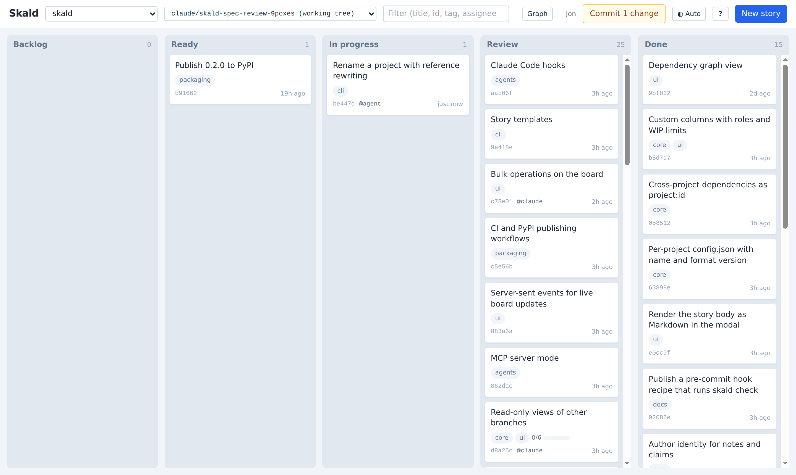
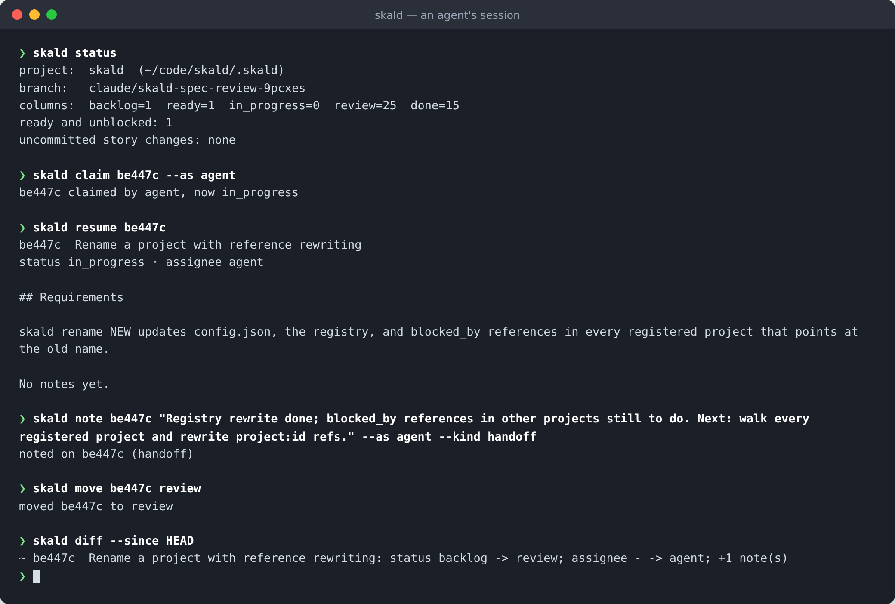
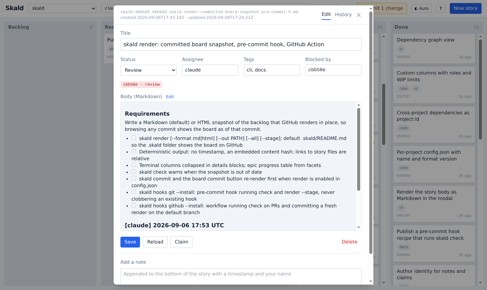

# Skald

Kanban lite for coding agents.

Skald is a backlog tracker that lives inside your repository as Markdown
files. AI coding agents drive it from a small CLI. Humans drive it from a
local web board that can show every project on the machine. There is no
database and no service to run; the whole thing is one dependency-free Python
package.

```
.skald/
├── config.json   # project name, story format version, columns  (committed)
├── AGENTS.md     # what an agent needs to know, written by `init` (committed)
├── stories/      # one Markdown file per story                   (committed)
│   └── a3f9c2-implement-wireguard-overlay.md
└── archive/      # done stories moved out of the way by `skald archive`
```

Stories are committed with the code they describe, so the board travels with
the branch and shows up in pull request diffs.

<picture>
  <source media="(prefers-color-scheme: dark)" srcset="docs/images/board-dark.png">
  
</picture>

<table>
<tr>
<td width="50%" valign="top"></td>
<td width="50%" valign="top"></td>
</tr>
<tr>
<td align="center"><sub>An agent's session: claim, resume, hand off, move, and see the diff.</sub></td>
<td align="center"><sub>The same story on the board: dependencies, acceptance criteria, notes.</sub></td>
</tr>
</table>

## Is Skald the right tool?

Several projects keep a tracker inside the repository. They make different
trade-offs, so this table is about focus rather than ranking. Checked against
each project's README in September 2026; follow the links for current detail.

| | [Skald](https://github.com/Vitund-AI/skald) | [Backlog.md](https://github.com/MrLesk/Backlog.md) | [Beads](https://github.com/steveyegge/beads) | [git-bug](https://github.com/git-bug/git-bug) | [git-issue](https://github.com/dspinellis/git-issue) |
|---|---|---|---|---|---|
| Data lives in | Markdown files under `.skald/`, committed | Markdown files under `backlog/`, committed | Dolt database under `.beads/`, with a JSONL export | Git objects, not files in the worktree | Text files under `.issues/`, committed |
| Unit of work | Story: column, rank, dependencies, tags, dated notes | Task: status, acceptance criteria, dependencies, labels, milestones | Issue: status, priority, assignee, dependencies, labels, hierarchy | Issue with comments, labels, status | Issue with comments, tags, assignee, milestone, due date |
| Built for | Coding agents first, humans reviewing on a board | Humans and agents together | Agents, with memory decay of closed work | Humans, distributed and offline-first | Humans, git-native |
| Agent interface | CLI, MCP server, Claude Code hooks and skill, `AGENTS.md` | CLI, MCP server, `AGENTS.md` | CLI with JSON output, MCP server, `AGENTS.md` | CLI | CLI |
| Human interface | Local web board across all projects on the machine | Terminal board and local web board | CLI | CLI, TUI, web UI | CLI |
| More than one repository | Yes: one board, `project:id` references | One project per workspace | Separate repos with routing and sync | Per repository, pushed to remotes | Per repository |
| Committed snapshot | `skald render` writes Markdown or HTML with a dependency graph | `backlog board export` writes a Markdown report | No | No | No |
| Sync with hosted trackers | No | No | No | Bridges to GitHub and GitLab | Import and export with GitHub and GitLab |
| Runtime | Python, standard library only | TypeScript on Bun or Node | Go | Go | Shell, `jq`, `curl` |

Skald is a good fit when agents do most of the work, a human wants to see
that work on one board across repositories, and the backlog should read well
in a pull request diff. Reach for something else when you want threaded
discussion on issues (git-bug, or the hosted tracker you already use), a long
history that needs summarising to save context (Beads), or two-way sync with
GitHub issues (git-bug, git-issue).

## Install

Skald is not on PyPI yet; it needs more time on real backlogs first. Install
straight from this repository:

```sh
pip install git+https://github.com/Vitund-AI/skald.git
# or: pipx install git+https://github.com/Vitund-AI/skald.git
# or: uv tool install git+https://github.com/Vitund-AI/skald.git
cd your-repo
skald init
```

Append `@main` or a tag such as `@v0.2.0` to the URL to pin a revision. Upgrade
with the same command plus `--upgrade` (`pipx upgrade skald-kanban` or
`uv tool upgrade skald-kanban` for those tools). The distribution name stays
`skald-kanban`, so nothing changes when it reaches PyPI.

`init` creates `.skald/`, writes `AGENTS.md`, and registers the project in
your machine-local index so the board can find it. It is safe to run again,
and it never touches existing stories. Because the package installs a
`git-skald` command, `git skald ...` works everywhere `skald ...` does.

Then add one line to your repository's `CLAUDE.md` or `AGENTS.md`:

> This repository tracks work with Skald. Read `.skald/AGENTS.md` before
> starting any task.

**Joining a repository someone else set up:** just clone it and run any
`skald` command inside it. The backlog is already there; the first command
registers the project on your machine.

### Shell completion

```sh
eval "$(skald completion zsh)"       # in ~/.zshrc
eval "$(skald completion bash)"      # in ~/.bashrc
skald completion fish > ~/.config/fish/completions/skald.fish
```

Tab completes subcommands and flags, story ids (zsh and fish show the title
and status next to each id), column keys after `move` and `--status`, tags
after `tag` and `--tags`, blockers after `block`, project names after `-p`,
templates, branch names, and note kinds. `git skald` completes the same way.
The scripts are thin shims that ask `skald` itself for candidates, so they
never go out of date.


## Quick start

```sh
skald new "Implement WireGuard overlay" --tags infra --body "Configure wg0 on every node."
skald new "Write the network docs" --status ready --blocked-by a3f9c2
skald ls
skald open            # starts the board server if needed and opens this project
```

An agent's session looks like this:

```sh
skald context --as claude         # mine, next, blockers, claims elsewhere, uncommitted
skald claim a3f9c2 --as claude    # assign it and move it to in_progress
skald resume a3f9c2               # requirements, checklist, deps, latest handoff
skald note a3f9c2 "Why we chose X" --as claude --kind decision
# ... write code, tick acceptance criteria ...
skald note a3f9c2 "Done: ... Remaining: ... Next: ..." --as claude --kind handoff
skald move a3f9c2 review
git add .skald src && git commit
```

`context` is built for the top of a session and for SessionStart hooks: it
is one bounded block rather than a listing. `resume` is what a fresh session
reads instead of the whole story file: the requirements, the checklist and
acceptance state, dependencies, every `decision` note, and only the latest
`handoff` note. `--compact` on `ls` and `next` trims the JSON to what an
agent needs.

Two conventions make this work. Notes carry a kind (`handoff`, `decision`,
`blocker`, or any short word) in their heading, and a `## Acceptance`
section holds a checklist of criteria. Moving a story to review or done with
unchecked criteria prints a warning, which is advisory like every other
warning.

When agents work in parallel worktrees, `next` skips stories that another
agent has claimed on another local branch and says so, `claim` warns before
taking over, and an assignment untouched for `stale_days` is offered to
`next` again with a warning.

## Story files

```markdown
---
title: "Implement WireGuard overlay network"
status: "ready"
rank: 20
tags: ["infrastructure", "v1.0"]
blocked_by: ["7b21e0", "api-server:c4d811"]
assignee: "claude"
created_at: "2026-09-05T10:00:00Z"
updated_at: "2026-09-06T08:12:41Z"
---
## Requirements

Configure the wg0 interface on every node...

- [x] write wg0.conf template
- [ ] systemd unit

## [claude] 2026-09-06 08:12 UTC
Claimed. Template done, unit next.
```

- The **frontmatter** is owned by Skald. Every value is a JSON literal, one
  field per line. Change it with the CLI or the board, never by hand. Unknown
  fields are preserved, so you can add your own.
- The **body** is free-form Markdown owned by people and agents. `skald note`
  appends a timestamped section. Task-list items show as progress on cards.
- The **filename** carries the id: six hex characters plus a cosmetic slug.
- `status` must be one of the project's column keys.
- `rank` orders cards within a column. Lower sorts first.
- `blocked_by` is advisory. Moving a blocked story forward prints a warning
  and still succeeds. An entry written as `project:id` points at a story in
  another repository registered on this machine.
- `assignee` is free text. `skald next` skips stories assigned to someone else.

## Columns

Each project defines its own columns in `.skald/config.json`. A column has a
key, a label, a role, and an optional WIP limit:

```json
{
  "format": 1,
  "name": "api-server",
  "columns": [
    {"key": "backlog",     "label": "Backlog",     "role": "backlog"},
    {"key": "ready",       "label": "Ready",       "role": "ready"},
    {"key": "in_progress", "label": "In progress", "role": "active", "limit": 3},
    {"key": "qa",          "label": "QA",          "role": "active"},
    {"key": "done",        "label": "Done",        "role": "done"},
    {"key": "wont_do",     "label": "Won't do",    "role": "closed"}
  ]
}
```

Roles give the tool its semantics: `next` picks from `ready` columns, `claim`
moves into the first `active` column, `done` and `closed` columns are terminal
(hidden by default, satisfy dependencies, archivable), and moving into
`ready`, `active`, or `done` warns about unmet dependencies. A story whose
status matches no column still shows up, in an "Unknown status" column on the
board and as a problem from `skald check`.

## Projects on one machine

Every `skald` command registers the current project in a machine-local index
(`~/.config/skald/projects.json`, or `%APPDATA%\skald` on Windows, or
`$SKALD_HOME`). Nothing in that directory is ever committed.

```sh
skald projects                    # what is registered here
skald -p api-server ls            # act on another project from anywhere
skald ls --all-projects           # everything, ids shown as project:id
skald next --all-projects
skald projects rm old-thing       # forget one (files untouched)
```

The project name in `config.json` is what cross-project references use, so
it is the same on every clone. A reference to a project that is not
registered on this machine counts as unmet and is reported as a warning, not
an error, because you may simply not have cloned that repository yet.

## Epics and other facets

A tag written as `key:value` is a facet. `epic:auth` makes an epic without
any schema change, and because tags are plain strings it works across
projects too:

```sh
skald new "Login form" --tags epic:auth,area:web
skald ls --tag epic:auth                  # one epic
skald ls --all-projects --tag epic:auth   # the same epic across every repo
skald epics                               # progress per epic (shorthand for: facets epic)
skald facets                              # every facet key and value with done/open counts
```

The board shows one filter dropdown per facet key it finds, and a
"swimlanes by" control that splits the board into one lane per value with a
progress bar. Tags are lowercased, so `epic:User-Auth` becomes
`epic:user-auth`.

## Dependency graph

```sh
skald graph                       # Mermaid, which GitHub renders inside Markdown
skald graph --format dot | dot -Tsvg > deps.svg
skald graph --format json
```


Only stories with a dependency appear, so the graph stays readable. Nodes
are coloured by column role, cross-project targets are dashed, satisfied
edges are grey, unmet edges are highlighted, and cycles are red. The
rendered snapshot includes the graph as a Mermaid block, and the board has
a Graph toggle (`g`) that draws the same layered graph as inline SVG with
click-to-open.

## Other branches

Stories live on the branch you have checked out. Skald can read `.skald/`
from any other branch, local or remote, straight from git objects, without
touching your working tree:

```sh
skald branches                    # per-branch counts and how each differs from here
skald ls --all-branches           # stories that exist only on, or differ on, other branches
skald ls --branch feature/x       # a branch's board, read-only
skald show a3f9c2 --branch origin/main
```

The board has a branch dropdown next to the project name and a badge
counting stories that exist only elsewhere. Other branches are read-only
views, and dependencies never resolve across branches: a blocker being done
on `feature/x` does not unblock anything on `main`.

## Web board

```sh
skald open              # ensure the background server is running, open this project
skald server start      # or manage it explicitly
skald server status
skald server stop
skald serve             # run in the foreground instead
```

One server shows every registered project; switch with the dropdown or
choose "All projects" for a single list of ready, unblocked work everywhere.
The page listens to a server-sent event stream, so a change made from the
CLI or by an agent appears within a second without a refresh.
Drag cards between and within columns, or Tab to a card and press Enter.
Press and hold a card (or press `x` on a focused one) to start a selection
in its column: click other cards to add or remove them, drag any selected
card to move the batch, or use the bar at the bottom to move, tag, or
archive them together. A click in another column or `Esc` ends it.


Click a card to edit it, preview the body as Markdown, append a note, claim
it, or see its git history. Blocked cards show a lock, stale active cards
show a marker, and columns over their WIP limit turn red. The header shows
the current branch and, when story files are uncommitted, a button that
commits just `.skald/` (and pushes, if you enable that). A toast announces
changes made outside the board, and new commits on the branch.

Press `?` for the Help panel: keyboard shortcuts, what the card markers
mean, the story file format, and the full CLI reference, generated from the
same parser as `skald --help` so it can never lag behind. The theme follows
the operating system; the header button forces light or dark, and the choice
is remembered per browser. Columns share the width on wide screens and stack
on phones.

The board uses Tailwind and marked from CDNs, so styling and Markdown
preview need internet access. The server binds to `127.0.0.1` and has no
authentication; every write endpoint changes files, so only expose it on
other interfaces deliberately.

## User settings

```sh
skald config                      # show all
skald config author "Jon"         # name used for notes and claims made from the board
skald config push true            # let the board's commit button also push
skald config port 9000
skald config stale_days 5
```

Notes made from the CLI are labelled `agent` unless you pass `--as NAME` or
set `SKALD_AUTHOR`. Notes made from the board use `SKALD_AUTHOR`, then the
configured `author`, then your git `user.name`.

## CLI

Any `<id>` may be a unique prefix. Commands that print stories take `--json`.
Exit codes: 0 success (warnings on stderr), 1 usage error or not found, 2
corrupt story or configuration.

| Command | What it does |
| --- | --- |
| `init [--name N]` | Create `.skald/` here, or register an existing one. Removes the 0.1 vendored layout. |
| `status` | Project, branch, per-column counts, uncommitted story files. |
| `ls [--status C] [--tag T] [--assignee A] [--unblocked] [--all] [--archived] [--all-projects] [--branch REF] [--all-branches]` | List stories. Hides terminal columns unless `--all`. |
| `context [--as NAME]` | One orientation block: assigned stories with last notes, next story, blocked ready stories, stale claims, claims on other branches, uncommitted files. |
| `resume <id>` | Requirements, checklist and acceptance state, dependencies, decisions, latest handoff. |
| `next [--as NAME] [--all-projects] [--compact]` | First ready, unblocked story available to the caller; skips claims on other branches; offers stale assignments. Exit 1 if none. |
| `show <id> [--branch REF]` | Print the file. `--json` adds derived fields, body, and body hash. |
| `branches` | Story counts per branch and how each differs from the working tree. |
| `new "<title>" [--status C] [--tags a,b] [--blocked-by id,proj:id] [--body TEXT \| -] [--template T] [--assignee A]` | Create a story and print its id. |
| `move <id> <column>` | Change status. Warns on unmet dependencies and WIP limits. |
| `claim <id> --as NAME` | Assign and move into the first active column. |
| `set <id> title="..." rank=N assignee=NAME` | Edit fields. `assignee=` clears it. |
| `tag <id> +tag -tag` | Add or remove tags. |
| `block <id> +id -id` | Add or remove dependencies. `proj:id` for another project. Cycles warn. |
| `note <id> "<text>" \| - [--as NAME] [--kind K]` | Append a timestamped note; kind `handoff`, `decision`, `blocker`, or any short word. |
| `log <id>` | Git history of the story file. |
| `archive [id ...] [--dry-run]`, `unarchive <id>` | Move terminal stories to `.skald/archive/` and back; with ids, only those (each must be done or closed). |
| `check [--hook]` | Validate every file. Exit 2 on problems. `--hook` also fails on uncommitted story files. |
| `commit [-m MSG] [--push] [--no-trailers]` | Commit everything under `.skald/` and nothing else, with `Skald-Story` trailers. |
| `commits <id> [--all-branches]` | Commits referencing the story via trailer or `[id]`. |
| `diff --since REF [--until REF] [--markdown]` | New, changed, and removed stories between two states. |
| `activity [--since REF] [--until REF]` | Backlog events per commit, oldest first. |
| `changelog --since REF [--until REF]` | Stories that reached a terminal column between two git refs. |
| `facets [KEY] [--all-projects]`, `epics` | `key:value` tags with total, done, open, and progress. |
| `graph [--format mermaid\|dot\|json] [--all] [--archived]` | Dependency graph. |
| `columns`, `templates`, `projects`, `config` | Inspect configuration. |
| `render [--format md\|html] [--out PATH] [--archived] [--stage] [--stdout] [--enable]` | Write a committed snapshot of the board. |
| `hooks claude\|git\|github [--install]` | Print or install the Claude Code hooks, a pre-commit hook, or a GitHub workflow. |
| `open`, `server start\|stop\|status`, `serve` | The board. |
| `completion bash\|zsh\|fish` | Print the shell completion script to `eval` from your rc file. |
| `mcp` | Serve the store as MCP tools over stdio (see below). |

`-p NAME` before any command targets a registered project instead of the
current directory.

## Linking commits to stories

`skald commit` adds a `Skald-Story: <id>` trailer for every story file it
touches. For code commits, add the same trailer yourself, or put `[a3f9c2]`
in the subject:

```sh
git commit -m "Add wg0 template" --trailer "Skald-Story: a3f9c2"
skald commits a3f9c2              # every commit that references the story
```

The story modal's History tab shows those commits above the story file's
own history.

## Reviewing what changed

```sh
skald diff --since main                  # new, changed, removed stories vs the working tree
skald diff --since v1.0 --until v1.1 --markdown
skald activity --since HEAD~20           # every event, one line each, oldest first
skald changelog --since v1.0             # stories that reached done between two refs
```

`diff` compares two states by id and reports status, assignee, title, tag,
blocker, and archive changes, plus notes added. `activity` walks every
commit that touched `.skald/` and reports the same events per commit, which
is the quickest way to see what agents did overnight. The GitHub workflow
posts `diff --markdown` as a comment on every pull request and keeps it up
to date.

## A board you can see on GitHub

```sh
skald render                 # writes .skald/README.md
skald render --enable        # and make commit, the board button, and hooks re-render it
skald render --format html --out docs/board.html
```

The snapshot is Markdown by default, so GitHub renders it in place, and it
lives at `.skald/README.md` so that clicking into the `.skald` folder on
GitHub shows the board. Every id links to its story file. Terminal columns
are collapsed, epics get a progress table, and the output is deterministic:
no timestamp, just an embedded content hash, so an unchanged backlog produces
no diff. `skald check` warns when the snapshot is out of date.

Two installers keep it fresh without anyone remembering:

```sh
skald hooks git --install       # pre-commit hook: skald check, then skald render --stage
skald hooks github --install    # .github/workflows/skald.yml: check on PRs, re-render on the default branch
```

Both enable automatic rendering in `config.json` if it is not already on.
The pre-commit installer refuses to overwrite a hook it did not write.

## Agent hooks

```sh
skald hooks claude --install
```

adds two hooks to `.claude/settings.json`, a SessionStart hook that runs
`skald status && skald ls` so the agent starts every session oriented and a
Stop hook that runs `skald check` so it cannot finish with a broken backlog,
and writes `.claude/skills/skald/SKILL.md` so Claude Code loads the contract
as a skill whenever backlog work comes up. `skald init` also appends the
one-line pointer to the root `CLAUDE.md` and `AGENTS.md`, creating
`AGENTS.md` if neither exists.
With `--strict` the Stop hook is `skald check --hook`, which also fails while
story files are uncommitted, enforcing the "commit stories with code" rule.

For CI or a pre-commit hook, `skald check` exits non-zero on corrupt files,
dangling or self references, unknown statuses, cycles, and conflict markers:

```sh
# .git/hooks/pre-commit
#!/bin/sh
exec skald check
```

## MCP server

Agents that cannot run shell commands can use Skald through the Model
Context Protocol. From inside a project:

```sh
claude mcp add skald -- skald mcp
```

The server speaks JSON-RPC over stdio and exposes `skald_status`,
`skald_columns`, `skald_list`, `skald_next`, `skald_show`, `skald_new`,
`skald_move`, `skald_claim`, `skald_note`, `skald_context`, `skald_resume`,
`skald_set`, `skald_tag`, `skald_block`, and `skald_check`. Every tool takes an optional `project`
argument; without it the project is the one containing the current
directory. Results are JSON text, and Skald warnings come back inside the
result rather than as errors.

## Templates

Put Markdown files in `.skald/templates/` and create stories from them:

```sh
skald new "Login crashes on Safari" --template bug
```

The template becomes the body; any `--body` text is appended after it.

## HTTP API

All bodies are JSON. Errors are `{"error": "..."}` with a 4xx or 5xx status.
Project names come from the registry; the API never accepts a path.

| Method and path | Body | Result |
| --- | --- | --- |
| `GET /api/health` | | `{ok, version, pid}` |
| `GET /api/projects` | | `{projects, settings}` |
| `GET /api/help` | | `{version, commands: [{name, help, usage, arguments, subcommands}]}`, the CLI reference read from the argparse parser |
| `GET /api/ready` | | ready, unblocked stories across all projects |
| `GET /api/projects/<p>/board[?ref=REF]` | | `{columns, stories, facets, git, identity, settings, version, warnings}`; `git` carries `branch`, `head`, and `changes`; with `ref`, a read-only snapshot of that branch |
| `GET /api/projects/<p>/branches` | | `{current, branches: [{name, sha, remote, stories, only_there, only_here, differ}], elsewhere}` |
| `GET /api/projects/<p>/version` | | a hash that changes whenever any story file changes |
| `GET /api/projects/<p>/events` | | server-sent events: `hello` on connect, `change` whenever the hash changes |
| `POST /api/projects/<p>/stories` | `{title, status?, tags?, blocked_by?, body?, assignee?, template?}` | 201, `{story, warnings}` |
| `GET /api/projects/<p>/stories/<id>[?ref=REF]` | | story with `body`, `body_sha256`, and `deps`; with `ref`, as it is on that branch |
| `PATCH /api/projects/<p>/stories/<id>` | any of `{title, status, rank, tags, blocked_by, assignee, order}` | `{story, warnings}` |
| `PUT /api/projects/<p>/stories/<id>/body` | `{body, base_sha256}` | story, or 409 if the body changed on disk |
| `POST /api/projects/<p>/stories/<id>/notes` | `{text, author?}` | 201, story with body |
| `POST /api/projects/<p>/stories/<id>/claim` | `{author?}` | `{story, warnings}` |
| `GET /api/projects/<p>/stories/<id>/history` | | `{history: [{sha, date, author, subject}]}` |
| `DELETE /api/projects/<p>/stories/<id>[?force=1]` | | 204, or 409 if other stories depend on it |
| `GET /api/projects/<p>/git` | | `{branch, changes, push_enabled, identity}` |
| `POST /api/projects/<p>/git/commit` | `{message?, push?}` | `{sha, message, pushed, output}` |
| `POST /api/projects/<p>/archive` | `{ids?}` | `{archived: [ids]}`; without `ids`, every done or closed story; with them, only those, 400 if any is not in a terminal column |
| `GET /api/projects/<p>/templates` | | `{templates}` |

`order` is the full ordered list of ids for the story's column. Sending
`status` and `order` together moves and reorders in one request.

## Upgrading from 0.1

Run `skald init` in the repository. It deletes the vendored `.skald/skald.py`,
removes the old git alias, writes `config.json`, and registers the project.
Story files are unchanged.

## Development

```sh
pip install -e .
python -m unittest          # standard library only
skald serve                 # run against this repository's own backlog
```

This repository dogfoods Skald: its own backlog is in `.skald/`. The design is
in [SPEC.md](SPEC.md) and the reasoning behind non-obvious choices is in
[DECISIONS.md](DECISIONS.md).

## License

MIT. See [LICENSE](LICENSE).
