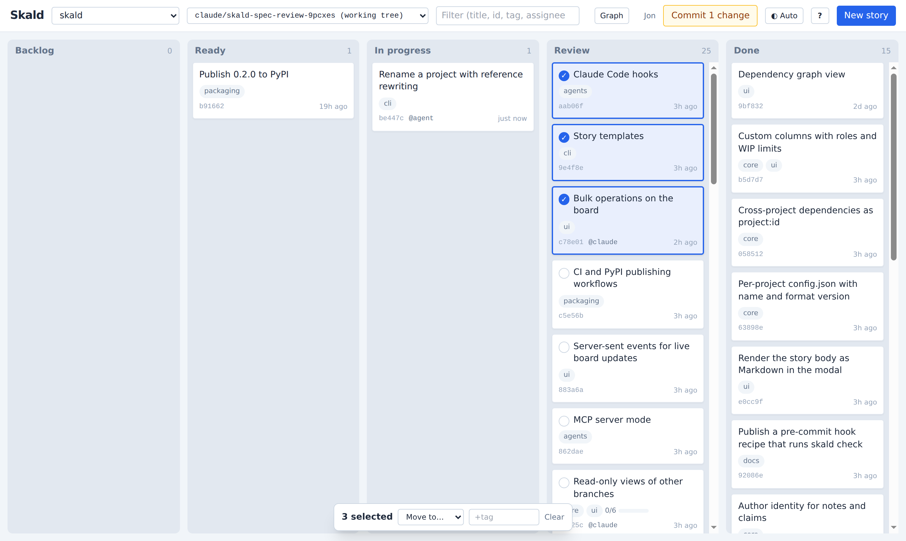
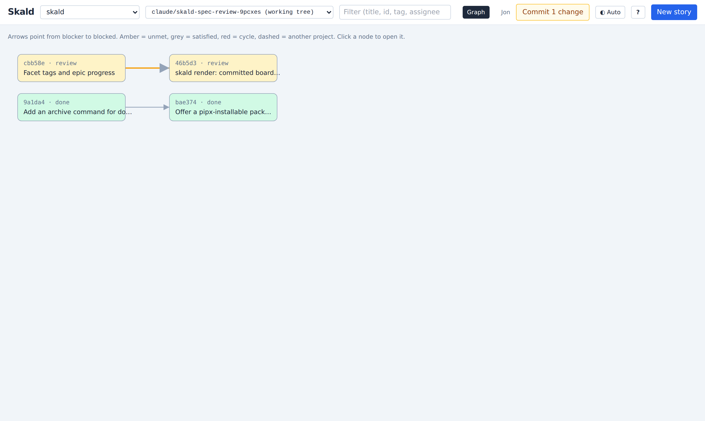

# The board

One local web page that shows every registered project, updates live, and
never needs a login.

```sh
skald open              # ensure the background server is running, open this project
skald server start      # or manage it explicitly
skald server status
skald server stop
skald serve             # run in the foreground instead
```

The server binds to `127.0.0.1` on port 8321 by default (`skald config port`
changes it). It has no authentication and every write endpoint changes
files, so only expose it on other interfaces deliberately. The page loads
Tailwind and marked from CDNs, so styling and Markdown preview need internet
access; without it the board still works, unstyled.

## Header

- **Project** switches between registered projects. "All projects: ready
  work" is a single list of ready, unblocked stories everywhere; click one to
  open it in its project.
- **Branch** shows the working tree by default. Choosing another branch,
  local or remote, shows a read-only view of the backlog as it is there,
  with a banner and no editing. A badge counts stories that exist only on
  other branches.
- **Filter** matches title, id, tag, or assignee. `/` focuses it.
- **Facet filters and swimlanes** appear when stories carry `key:value`
  tags. One dropdown per key filters; "swimlanes by" splits the board into
  one lane per value with a progress bar per lane.
- **Graph** (`g`) draws the dependency graph.
- **Identity** is the name notes and commits from the board will carry.
- **Commit N changes** appears when story files are uncommitted. It commits
  only `.skald/` and, when enabled, the rendered snapshot; with `skald
  config push true` it can push too.
- **Theme** cycles Auto, Light, Dark. Auto follows the operating system and
  the choice is remembered per browser.
- **?** opens the Help panel: shortcuts, what the card markers mean, the
  story file format, and the full CLI reference generated from the same
  parser as `skald --help`.

## Columns and cards

Columns come from `.skald/config.json` with their labels and WIP limits; a
column over its limit turns its count red. A story whose status matches no
column appears in an "Unknown status" column. Columns share the width on
wide screens and stack vertically on phones.

A card shows the title, tags, checklist progress, id, assignee, and age.
Markers:

- **Red left edge and a lock**: blocked by an unmet dependency. Hover the
  lock for the list.
- **Amber left edge and "stale"**: an active story untouched for
  `stale_days`.
- **"also name@branch"**: the story is claimed by someone else on another
  branch.

Drag a card to move it between columns or reorder it within one. Tab
reaches cards and Enter opens them. Clicking a card opens it.

## The story dialog

Title, status, assignee, tags, and blockers are editable fields. Dependency
chips below them show each blocker's state and open it on click, switching
project if it lives elsewhere. The body is Markdown with a Preview toggle;
Save writes it back and refuses with a message if the file changed on disk
while you were editing, so nothing is silently overwritten. Add a note
appends a dated note under your identity. Claim assigns the story to you and
starts it. Delete removes the file, asking first if other stories depend on
it. The History tab lists code commits that reference the story above the
story file's own history.

## Selecting several cards

Press and hold a card for about half a second, or press `x` on a focused
card, to start a selection in that column. Every card in the column shows a
circle; selected ones show a check. Click cards to add or remove them. Drag
any selected card and the whole batch moves, landing in selection order at
the drop point. The bar at the bottom moves the batch to a column, adds a
tag to each story, or archives them when the column is done or closed.
Clicking in another column or pressing `Esc` ends the selection.



## The graph

`g` toggles a layered dependency graph. Only stories with a dependency
appear, so it stays readable. Nodes are coloured by column role,
cross-project targets are dashed, satisfied edges are grey, unmet edges are
highlighted, and cycles are red. Click a node to open it.



## Live updates

The page listens to a server-sent event stream, so a change made from the
CLI, by an agent, or by a hook appears within a second without a refresh. A
toast announces changes made outside the board and new commits on the
branch. Columns keep their scroll position across updates.

## Keyboard shortcuts

| Key | Action |
| --- | --- |
| `n` | New story |
| `/` | Focus the filter |
| `g` | Toggle the graph |
| `?` | Help |
| `x` | Start or toggle selection on the focused card |
| `Tab`, `Enter` | Move between cards, open the focused one |
| `Esc` | Close a dialog, end a selection |
