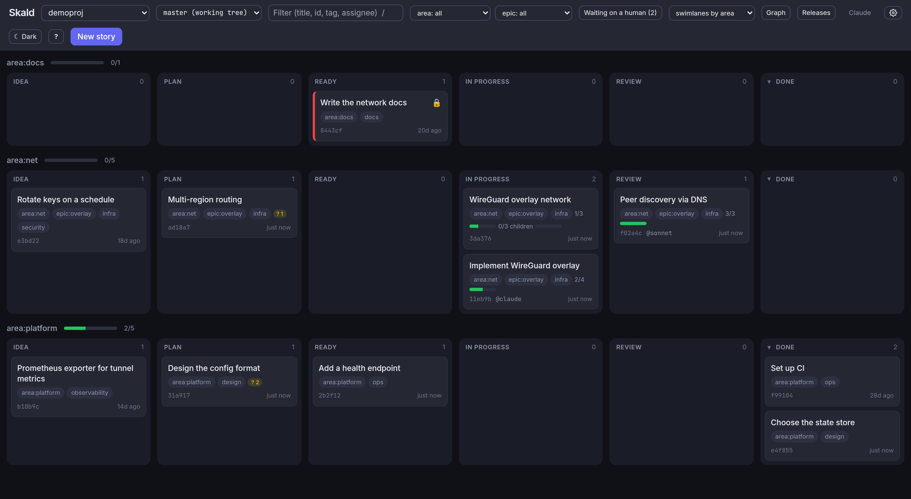

# The board

One local web page that shows every registered project, updates live, and
needs no account: `skald open` carries the key.

```sh
skald open              # ensure the background server is running, open this project
skald server start      # or manage it explicitly
skald server status
skald server stop
skald serve             # run in the foreground instead
```

The server binds to `127.0.0.1` on port 8321 by default (`skald config port`
changes it). The page loads Tailwind and marked from CDNs, so styling and
Markdown preview need internet access; without it the board still works,
unstyled.

## Access

The server requires a key. `skald open` handles it: the first server start
generates a random token in your machine-local directory (a private file,
never committed), and `skald open` opens the board with the key in the URL
fragment. The page trades it for a session cookie and drops it from the
address bar. A board opened by typing the address shows one line asking you
to run `skald open`.

Why: a localhost bind keeps the network out, but not other users on the
machine, and not the web pages you visit, which can send requests to
`127.0.0.1` from your own browser. The cookie is `HttpOnly` and
`SameSite=Strict`, and the server refuses requests whose `Host` header is
not this machine, so neither a hostile page nor a DNS name pointing at
127.0.0.1 can ride your session.

Scripts send the same token as a header, from `skald server token`:

```sh
curl -H "Authorization: Bearer $(skald server token)" http://127.0.0.1:8321/api/projects
skald server token --rotate      # new token; browser sessions and scripts must reconnect
```

`/api/health` is the only open endpoint. Exposing the server on another
interface still means plaintext HTTP, so do that deliberately.

## Header

- **Project** switches between registered projects. "All projects: ready
  work" is a single list of ready, unblocked stories everywhere; click one to
  open it in its project.
- **Branch** shows the working tree by default. When the project has more
  than one checkout on this machine, the dropdown starts with a "Working
  trees" group: one entry per checkout reading `worktree` or `clone`, then
  the directory, the branch, and a count of uncommitted story files, such
  as `worktree skald-agent-two · agent-two · 2 uncommitted`. Choosing one
  shows that working tree, edits and all, and it is editable; a banner
  names the path. Below that, choosing a branch, local or remote, shows a
  read-only view of the backlog as it is committed there, with a banner and
  no editing; a branch that one of the working trees is on reads
  `committed only`, because the working tree above it has the rest. A badge
  counts stories that exist only on other branches. See
  [Working trees and branches](#working-trees-and-branches).
- **Filter** matches title, id, tag, or assignee. `/` focuses it.
- **Facet filters and swimlanes** appear when stories carry `key:value`
  tags. One dropdown per key filters; "swimlanes by" splits the board into
  one lane per value with a progress bar per lane. When any story has a
  parent, "swimlanes by parent" gives one lane per parent, titled, with its
  children's progress.
- **Waiting on a human** appears when any story has an open question and
  filters the board to those stories; the count is in the label.
- **Graph** (`g`) draws the dependency graph.
- **Releases** lists what shipped, grouped by version, newest first; a story opens read-only.
- **Identity** is the name notes and commits from the board will carry.
- **Commit N changes** appears when story files are uncommitted. It commits
  only `.skald/` and, when enabled, the rendered snapshot; with `skald
  config push true` it can push too.
- **Update available** appears as a small pill only when the opt-in update
  check is on and a newer `skald-kanban` has been released; it links to the
  releases page and can be dismissed until the next version. See
  [Settings](#settings).
- **Settings** (the gear) opens the settings panel: feature flags and a few
  preferences. See [Settings](#settings).
- **Theme** cycles Dark, Light, Auto. Dark is the default, Auto follows the
  operating system, and the choice is remembered per browser. See
  [Theme](#theme) for restyling the board.
- **?** opens the Help panel: shortcuts, what the card markers mean, the
  story file format, and the full CLI reference generated from the same
  parser as `skald --help`.

Swimlanes by a facet split the board into one lane per value, each with its
own columns and a progress bar:



## Columns and cards

Columns come from `.skald/config.json` with their labels and WIP limits; a
column over its limit turns its count red. A story whose status matches no
column appears in an "Unknown status" column. Columns share the width on
wide screens and stack vertically on phones.

A finished column (one with a `done` or `closed` role) has a caret in its
header that collapses it to a labeled strip showing its count; click the
strip to expand it again. It is a per-viewer preference kept in your
browser, so a large `Done` column or a "won't do" column can stop crowding
the active work without hiding it from anyone else or changing anything on
disk.

A card shows the title, tags, checklist progress, id, assignee, and age.
Markers:

- **Red left edge and a lock**: blocked by an unmet dependency. Hover the
  lock for the list.
- **Amber left edge and "stale"**: an active story untouched for
  `stale_days`.
- **"also name@branch"**: the story is claimed by someone else on another
  branch.
- **"1/3 children" with a blue bar**: a parent story, with its children
  done over total. The dialog lists them.
- **"? N" in amber**: N open questions, waiting on a human. The dialog
  lists them as Q1, Q2, ..., the numbers `skald resume` and `skald context`
  show, each with an Answer button. Select one and the send button reads
  "Answer Q2": your text becomes a decision note naming that question, and
  the others stay open, so the badge counts down as you work through them.
  With none selected the button reads "Answer all" and one decision names
  every open question. Only these, or `skald answer`, close a question; a
  note appended with "Append note" records a decision without closing
  anything.

Drag a card to move it between columns or reorder it within one. Tab
reaches cards and Enter opens them. Clicking a card opens it.

## The story dialog

The header shows the id, the created and updated dates, and the title.
Click the id to copy it; shift-click copies `project:id`, the form that
works from any project on the board. The dialog's address is kept in the
URL as `#story=ID`, so the link in the address bar opens straight to the
story for anyone with access to the board.

A story opens in **view mode**: a status select for a quick move, the
assignee, tag chips, a Claim button, dependency chips showing each
blocker's state (a click opens it, switching project if it lives
elsewhere), the parent as a chip that opens it, the children listed with
their state and struck through when done, "+ child" to open a new story
with this one already set as its parent, the body rendered as Markdown with
each note's heading set apart, open questions with an answer form, and Add
a note, which appends a dated note under your identity. A story id in the
rendered text (`a3f9c2`, `#a3f9c2`, or `project:a3f9c2`) is a link that opens
that story, switching project for a `project:id`. Claim assigns the
story to you and starts it; if the story is already active in another local
working tree or branch, a toast names that branch, so two agents do not
unknowingly work it at once even when they share a name.

When the project has a GitHub `origin` remote, an **Open in Claude Code**
button opens the story as a [Claude Code](https://claude.ai/code) session on
the web: it preselects the repository and prefills a short prompt that points
the session at the story (`skald show <id>`, then claim it and follow
`.skald/AGENTS.md`) rather than embedding the body, since the cloud checkout
can run `skald` itself. The prompt is not submitted automatically — you review
it first. The button is hidden when there is no GitHub remote, and it is
governed by the `claude_code_link` setting (on by default; see
[Settings](#settings)).

**Edit** (or `e`) switches to the form: title, status, assignee, tags,
blockers, parent, and the body with a Preview toggle. Save writes it back
and returns to view mode; it refuses with a message if the file changed on
disk while you were editing, so nothing is silently overwritten. Cancel, or
`Esc`, drops the edits and returns to view mode; `Esc` again closes the
dialog. Delete removes the file, asking first if other stories depend on
it. A new story opens straight in the form.

The History tab lists code commits that reference the story above the story
file's own history; on a parent it includes commits that reference its
children, each tagged with the child's id.

## Selecting several cards

Press and hold a card for about half a second, or press `x` on a focused
card, to start a selection in that column. Every card in the column shows a
circle; selected ones show a check. Click cards to add or remove them. Drag
any selected card and the whole batch moves, landing in selection order at
the drop point. The bar at the bottom moves the batch to a column, adds a
tag to each story, or archives them when the column is done or closed.
Clicking in another column or pressing `Esc` ends the selection.


## Working trees and branches

The dropdown offers two different things. A **working tree** is a checkout
of the project on this machine: the primary, a git worktree, or another
clone. Its view is the files on disk, so an agent working in a worktree
shows up mid-task, claims and notes included, before it commits anything.
Everything works there: drag, edit, notes, claims, and the commit button,
which commits in that checkout on its branch. Cards claimed in another
working tree show the "also name@branch" badge, so two agents in two
worktrees cannot both take a story.

A **branch** is a read-only snapshot of what is committed there. Use it to
review a branch you do not have checked out, or to compare. It cannot show
uncommitted work, which is why worktrees get their own entries, and why a
branch with a working tree on it is marked `committed only`. Hovering the
control says which of the two the current choice is.

Worktrees are found from `git worktree list` each time the list is
refreshed, which the board does every thirty seconds while the tab is
visible, so a new worktree appears within half a minute of `git worktree
add` and leaves when it is removed; nothing needs to run inside it. A
separate clone is the one case that needs a `skald` command run inside it
once, because nothing else can find it. The address bar carries an opaque
id for the checkout shown, never a path. See [Multiple projects](multi-project.md#several-checkouts-of-one-repository)
for how the primary is chosen.

## The graph

`g` toggles a layered dependency graph. Only stories with a dependency
appear, so it stays readable. Nodes are coloured by column role,
cross-project targets are dashed, satisfied edges are grey, unmet edges are
highlighted, and cycles are red. Click a node to open it.


## Releases

The **Releases** button switches to a view of what has shipped, read from the
archive: one section per version, newest first, listing the stories that
version carried (the done ones; a won't-do story lives in the changelog's
"Not doing" list, not here). Click a story to open it; because it is
archived it opens read-only. The same list is written into the committed
`.skald/README.md` by `skald render`, so it is browsable on GitHub too.

## Live updates

The page listens to a server-sent event stream, so a change made from the
CLI, by an agent, or by a hook appears within a second without a refresh. A
toast announces changes made outside the board and new commits on the
branch. Columns keep their scroll position across updates.

## Keyboard shortcuts

| Key | Action |
| --- | --- |
| `n` | New story |
| `/` | Focus the filter |
| `g` | Toggle the graph |
| `?` | Help |
| `x` | Start or toggle selection on the focused card |
| `Tab`, `Enter` | Move between cards, open the focused one |
| `e` | Edit the open story |
| `Esc` | Leave edit mode, close a dialog, end a selection |

## Settings

The gear in the header opens a settings panel. Everything here is
machine-local: it lives in `SKALD_HOME/config.json` and is never committed,
so it is per-person, per-machine.

- **Defaults (all projects)** holds the feature flags and a few
  preferences — the board author, whether to offer push after a commit, and
  the stale-after day count. A flag here is a plain on/off that applies
  everywhere unless a project overrides it.
- **This project** lists the same flags for the project on screen, each a
  three-way choice: *Inherit* (follow the default, which the option names as
  on or off), *On*, or *Off*. Inherit clears the per-project value so the
  default shows through again. This panel is hidden in the "All projects"
  view, which has no single project to scope to.

Feature flags come from a catalog the server sends, so the panel lists
whatever flags this version of Skald defines without any per-flag UI. The
current flags are **Open in Claude Code** (`claude_code_link`, on by default)
and **Check for updates** (`update_check`, off by default — the board asks
PyPI at most once a day whether a newer `skald-kanban` has shipped and shows
an "update available" pill when one has; off by default because it makes an
outbound request).
Changes save immediately and the board reflects them at once; the same
values are settable from the terminal with `skald config features.<name>`
(and `-p NAME` for one project).

## Theme

The board uses the Vitund design system: a dark canvas by default, Inter
for text and JetBrains Mono for ids, notes, and code (loaded from Google
Fonts, with system fonts as the fallback when the browser is offline), and
one accent colour with success, warning, danger, and info for the markers.
The Theme button switches to the light variant or to following the
operating system.

Every colour is a CSS custom property on the page's root element, and the
board's own classes only ever refer to those properties, so the palette can
be replaced without touching the package. The server serves
`SKALD_HOME/theme.css` (by default `~/.config/skald/theme.css`) at
`/theme.css`, linked after the board's own styles; create the file and
restart the server to restyle the board. The tokens:

| Token | Used for |
| --- | --- |
| `--canvas`, `--column`, `--surface`, `--chip`, `--hover` | the page, a column, a card or dialog, a chip, a hovered row |
| `--line`, `--line-strong` | borders, and the border of a hovered or focused element |
| `--ink`, `--muted`, `--faint` | text, secondary text, placeholders |
| `--accent`, `--accent-hover`, `--accent-text`, `--accent-tint` | buttons, links, the active tab, selected chips |
| `--success`, `--warning`, `--danger`, `--info`, each with `-text` and `-tint` | checklist progress, open questions, blocked and stale markers, notices |
| `--role-backlog`, `--role-ready`, `--role-active`, `--role-done`, `--role-closed`, `--role-unknown` | node fills in the graph, by column role |

Redefine them under `:root` for the dark theme and under
`:root[data-theme="light"]` for the light one; for example, a warmer accent:

```css
:root { --accent: #d97706; --accent-hover: #f59e0b; --accent-text: #fbbf24; --accent-tint: rgba(217, 119, 6, .15); }
:root[data-theme="light"] { --accent: #b45309; --accent-hover: #d97706; --accent-text: #92400e; --accent-tint: rgba(180, 83, 9, .1); }
```
