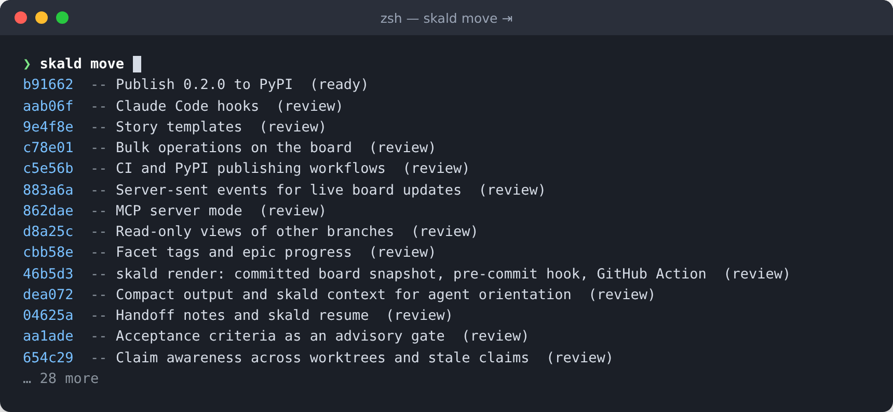

# Getting started

Ten minutes from nothing to a board with an agent working from it.

## Install

Skald is one Python package with no dependencies beyond the standard
library. Python 3.9 or newer, git, and a browser for the board.

```sh
pip install git+https://github.com/Vitund-AI/skald.git
# or: pipx install git+https://github.com/Vitund-AI/skald.git
# or: uv tool install git+https://github.com/Vitund-AI/skald.git
```

Skald is not on PyPI yet. Append `@main` or a tag such as `@v0.2.0` to pin
a revision. Upgrade with the same command plus `--upgrade`, or `pipx upgrade
skald-kanban` and `uv tool upgrade skald-kanban`. The distribution is named
`skald-kanban` because `skald` was taken; the command is `skald`, and it also
works as `git skald`.

## Set up a repository

```sh
cd your-repo
skald init
```

`init` creates `.skald/` with a `config.json` (project name and columns), an
`AGENTS.md` (the contract agents read), and an empty `stories/` folder. It
registers the project in your machine-local index so the board can find it,
and it appends one line to the root `CLAUDE.md` or `AGENTS.md`:

> This repository tracks work with Skald. Read `.skald/AGENTS.md` before
> starting any task.

It is safe to run again and never touches existing stories. Commit `.skald/`;
everything in it belongs in the repository.

**Joining a repository someone else set up:** clone it and run any `skald`
command inside it. The backlog is already there, and the first command
registers the project on your machine.

## Your first stories

```sh
skald new "Implement WireGuard overlay" --tags infra --body "Configure wg0 on every node."
skald new "Write the network docs" --status ready --blocked-by a3f9c2
skald ls
```

`new` prints the story's id, six hex characters. Every command that takes an
id accepts a unique prefix, so `skald show a3f` works. Stories start in the
backlog column unless you pass `--status`.

## Open the board

```sh
skald open
```

This starts the board server in the background if it is not running and
opens this project in your browser. One server shows every registered
project. Drag cards between columns, click one to edit it, press `?` for
the keyboard shortcuts and the built-in reference. See [The board](board.md).

## Hand it to an agent

The pointer `init` wrote into `CLAUDE.md` is all a well-behaved agent needs:
it reads `.skald/AGENTS.md` and follows the workflow there. For Claude Code,
also run:

```sh
skald hooks claude --install --as claude
```

That adds a SessionStart hook that runs `skald context --as claude`, so
every session begins oriented without the whole backlog in its context, a
Stop hook that refuses to end with a broken backlog, and a skill so the
contract loads when backlog work comes up. An agent's session then looks
like this:

```sh
skald context --as claude         # mine, next, blockers, claims elsewhere, uncommitted
skald claim a3f9c2 --as claude    # assign it and move it to in_progress
skald resume a3f9c2               # requirements, checklist, deps, latest handoff
skald note a3f9c2 "Why we chose X" --as claude --kind decision
skald note a3f9c2 "Done: ... Next: ..." --as claude --kind handoff
skald move a3f9c2 review
git add .skald src && git commit --trailer "Skald-Story: a3f9c2"
```

[Working with agents](working-with-agents.md) explains each step and the
choices behind it.

## Shell completion

```sh
eval "$(skald completion zsh)"       # in ~/.zshrc
eval "$(skald completion bash)"      # in ~/.bashrc
skald completion fish > ~/.config/fish/completions/skald.fish
```

Tab completes subcommands and flags, story ids (zsh and fish show the title
and status beside each id), column keys after `move` and `--status`, tags,
blockers, project names after `-p`, templates, branch names, note kinds, and
past versions after `--release`. `git skald` completes the same way. The
scripts ask `skald` itself for candidates, so they never go out of date.



## Upgrading from 0.1

Run `skald init` in the repository. It deletes the vendored `.skald/skald.py`,
removes the old git alias, writes `config.json`, and registers the project.
Story files are unchanged.

## Where things live

| Path | What | Committed |
| --- | --- | --- |
| `.skald/config.json` | Project name, format version, columns, render setting | Yes |
| `.skald/AGENTS.md` | The agent contract, written by `init` | Yes |
| `.skald/stories/*.md` | One file per story | Yes |
| `.skald/archive/*.md` | Archived stories | Yes |
| `.skald/templates/*.md` | Optional story templates | Yes |
| `.skald/README.md` | The rendered snapshot, when enabled | Yes |
| `~/.config/skald/` | Project index, your settings, the board's access token, server state and log | Never |

On Windows the machine-local directory is `%APPDATA%\skald`; `$SKALD_HOME`
overrides it anywhere.
